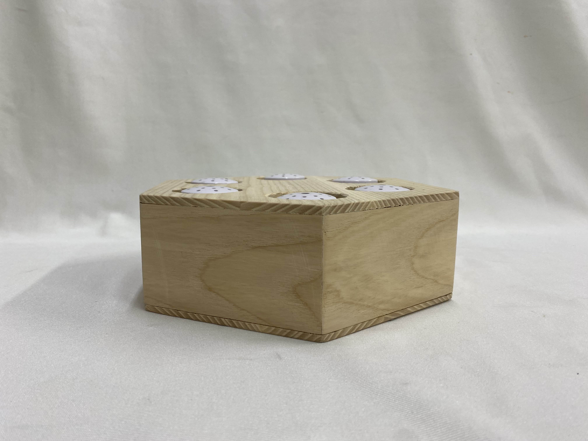
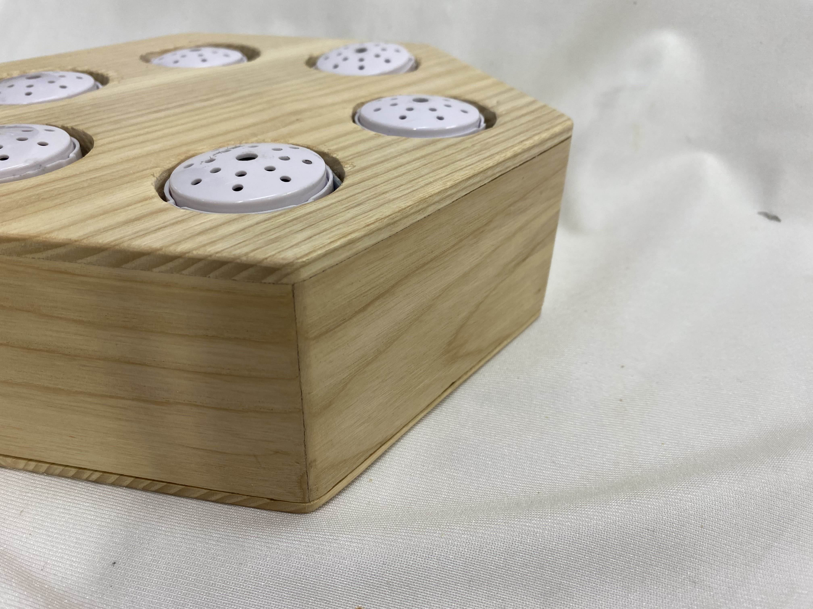
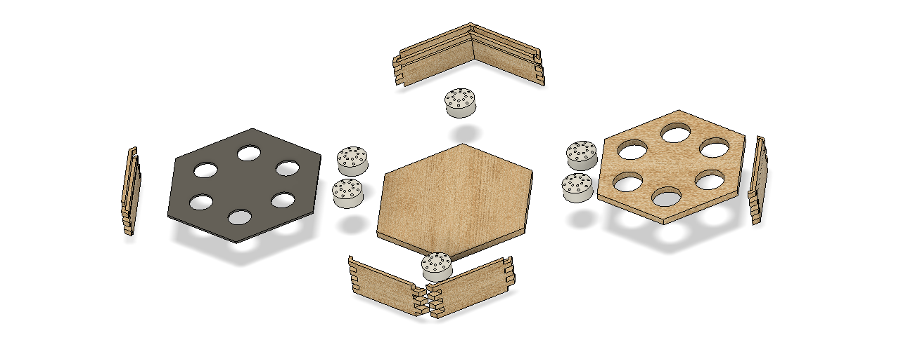
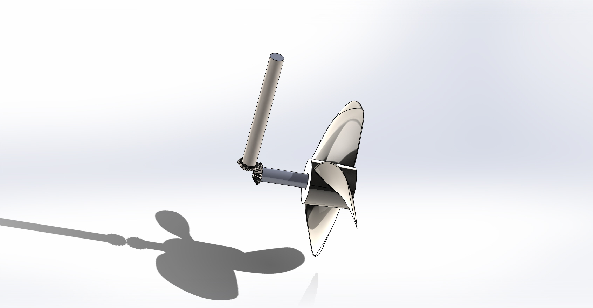

# Mechanical Engineering

# Projects
### Modelling of a V6 engine

With the use of solidworks modelled a fully working V6 engine for each part and includes the mating process ensuring all components move correctly

  
  

  

<!--Rotocopter Arduino Project-->

### Cochlear Implant Toy

Children with cochlear implants struggle with certain sounds due to the implants. To reduce the impact on their lives I designed and prototyped a sound recognition toy with the help of a parent group with children with cochlear implants. Through the use of speakers that can record then replay sounds with the parents being able to record sounds increasing familiarity therefore improving retention and recognision of important sounds in the English language. These specific sounds fall under specified frequency and loudness called the Speech banana. 

<table>
  <tr>
    <td align="center">
       
      Capture
    </td>
    <td align="center">
       
      Cochlear Implant
    </td>
  </tr>
  <tr>
    <td align="center">
       
      Cochlear Implant Close-up
    </td>
    <td align="center">
       
      Explosion
    </td>
  </tr>
</table>

# On Going Projects

### Hydroelectric motor

With sailing a deep passion of mine I wanted to create a project on capture of energy whilst on a sailing boat, whilst in the earlier stages of this project this will be updated. The idea is a hydroelectric motor that is connected to a dighy that is towed behind the sailing boat. Whilst in the dighy it will be collecting energy into the batteries and then can be use that harvested energy to act as an outboard motor for the dighy, reducing emissions and providing energy for other important systems on the sailing baot if needed. 

  
  

