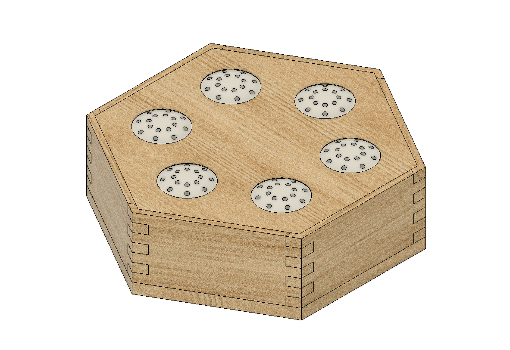
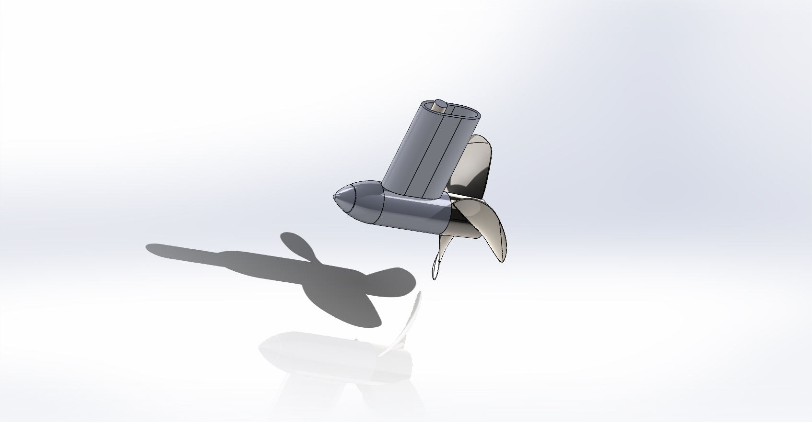

# Mechanical Engineering

# Projects

### Modelling of a V6 Engine

Using SOLIDWORKS, I modelled a fully working V6 engine, including the mating process, ensuring all components move correctly.

  
  

  

---

### Cochlear Implant Toy

Children with cochlear implants often struggle with recognizing certain sounds. To reduce this impact, I designed and prototyped a sound recognition toy with the help of a parent group whose children have cochlear implants.

The toy uses speakers that can record and replay sounds. Parents can record specific words, helping children become more familiar with them. This improves recognition and retention of important sounds in the English language.

These important sounds fall within a specific frequency and loudness range known as the "Speech Banana."

<!-- Top Row: Side-by-side -->

  
  

<!-- Stacked Images Below -->

  

  

---

# Ongoing Projects

### Hydroelectric Motor

Sailing is a deep passion of mine, and I wanted to create a project focused on capturing energy while at sea. This project is still in the early stages and will be updated as it progresses.

The concept involves a hydroelectric motor placed in a dinghy towed behind the sailing boat. While underway, the system captures energy and stores it in batteries. This harvested energy can then be used to power the dinghy as an electric outboard motor or provide power to other essential systems on the sailing boat, reducing emissions and increasing efficiency.

  
  

  

